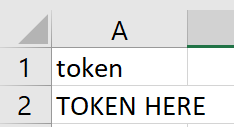

# Chicago Crime Shiny App

### This project visualizes Chicago's crime by pulling data from the City of Chicago API - Powered by Socrata

### Shiny App: https://bengarski.shinyapps.io/ChicagoCrime/
1. Page 1 visualizes the top 10 crime types for the past three months including homicide in an interactive map
2. Page 2 allows you to query the dataset for a select crime type and date range which outputs a time series graph and an exportable table

------------------------------------------------------------------------------------------------------------------------------------------
#### Dataset: https://data.cityofchicago.org/Public-Safety/Crimes-2001-to-present/ijzp-q8t2/data
#### Column Information: https://data.cityofchicago.org/Public-Safety/Crimes-2001-to-present/ijzp-q8t2
#### API Information: https://dev.socrata.com/foundry/data.cityofchicago.org/ijzp-q8t2
##### *Note: API Key was input into a csv file called token.csv in this format:

